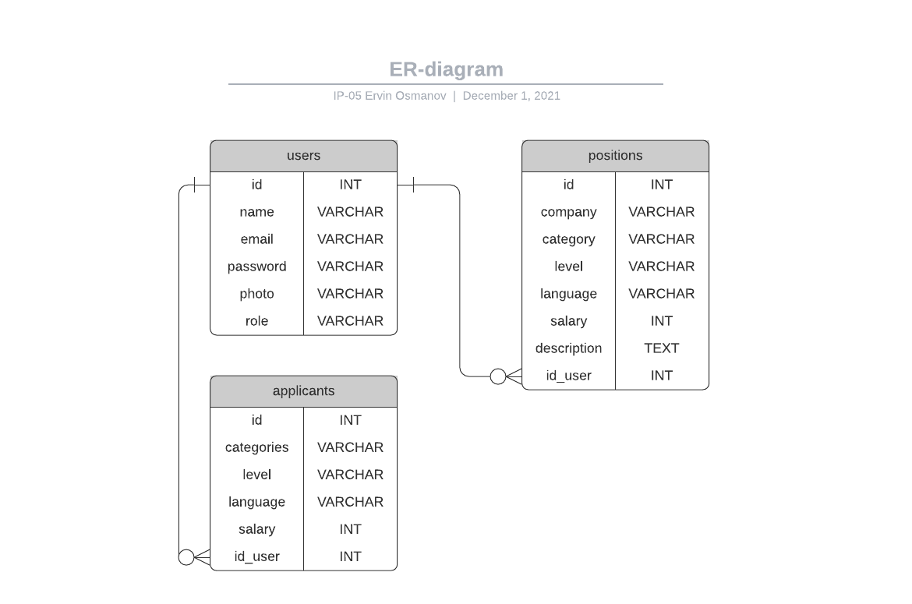

# api-dev

## Motivation

This application is inspired by the site [tokyodev](https://www.tokyodev.com/) - the way how software engineers can help each other to find a position in Japan.

## Technical requirements

API client is required to test this application.
I used app Postman.

I used npm libraries such as 'nodemailer', to send mails to applicants.

# Description

Everyone can post a position.

Everyone can be an applicant.

We keep only active positions

### Available values
>in case of PUT/POST requests and GET request with query string values with be coersed to available values

Available position categories: `nodejs`, `angular`, `javascript`, `react`.

Available position levels: `junior`, `middle`, `senior`.

Available position roles: `user`, `admin`.

Available position languages: `english`, `ukrainian`, `russian`.

#### Position added
Examples: 

(a) if an applicant has the following interests:

```json
{
    "categories": ["nodejs"],
    "level": "middle",
    "language": ["english"]
}
```
he will receive emails about new positions with:
 - `laguage: english`
 - `category: nodejs`
 - `level: middle`

(b) if an applicant has the following interests:

```json
{
    "language": ["english"],
    "categories": ["nodejs", "react"],
    "level": "senior"
}
```
he will receive emails about new positions with:
- `category: nodejs` or `category: react` 
- `"language": english`
 - `level: senior`


#### Position removed

Examples:

(a) if the following position is removed:
```json 
{
    "category": "nodejs",
    "level": "senior",
    ...
    "language": ["english"]
}
```

Applicants with (1) `nodejs` in list of categories and (2) level = `senior`  and (3) with `"language": english` will be notified.


(b) if the following position is removed:
```json 
{
    "category": "angular",
    "level": "junior",
    ...
    "language": ["ukrainian"]
}
```

Applicants with (1) `angular` in list of categories and (2) level = `junior` 
and (3.1) with `"language": ukrainian` or (3.2) with `"language": ukrainian, ...` will be notified


---
# API

# Users


## GET /user - Get user

### Request
Query parameter:
- `name` - find user by name

Examples:

_GET /user?name=Ervin_ - get user by name = Ervin

### Response
Success Code _"200 OK"_

Body = ```User[]```

___
## POST /user - Create a new user
### Request

Body = ```UserToAdd```

Example:

_POST /user_

```json
{
    "name": "Ervin",
    "email": "e@gmail.com",
    "password": "TestPass1234",
    "photo": "generate_name_for_photo.img",
    "role": "user"
}
```

### Response
Success Code *"201 Created"*. "id" in location

___
## PATCH /user/{user_id} - Update a user (OPTIONAL)
>Unlike PUT method, PATCH method applies a partial update to the resource.

### Request
Body = ```UserToPatch```

Example:

_PATCH /user/1_

```json
{
    "photo": "new_photo.img"
}
```
### Response
Success Code: *200 OK*

## DELETE /user/{user_id} - delete user and his positions or applicants
### Request
Example: 
_DELETE /user/1_
### Response
Success Code: *"204 No Content"*

___
___

# Positions


## GET /positions - Get list of all available positions 

### Request
Query parameter:
- `category` - filter positions by category (will be coersed to available categories)
- `level` - filter positions by lever
- `salary` - filter positions by salary
- `tag` - free search in description


Examples:

(1) _GET /positions?category=nodejs&level=middle&tag=relocation_ - get positions, filtered by category, level and tag

(2) _GET /positions?level=middle_ - get positions, filtered by level (no checks for tag and category required)

(3) _GET /positions_ - just return all positions


### Response
Success Code _"200 OK"_

Body = ```Position[]```
___
## GET /positions/{position_id} - Get position details by id
### Request
Example: 
_GET /positions/1_
### Response 
Success Code _"200 OK"_

Response Body = ```Position[]```
___
## POST /positions - Create a new opened position
### Request

Body = ```PositionToAdd```

Example:

_POST /positions_

```json
{
    "category": "nodejs",
    "company": "Rakuten",
    "level": "middle",
    "description": "We are looking for people who are flexible and highly skilled, with an interest in languages and other cultures. We are open to overseas candidates looking to relocate to Japan.",
    "language": ["english"],
    "salary": 500
}
```

### Response
Success Code *"201 Created"*. "id" in location

___
## PATCH /positions/{position_id} - Update a position (OPTIONAL)
>Unlike PUT method, PATCH method applies a partial update to the resource.

### Request
Body = ```PositionToPatch```

Example:

_PATCH /positions/1_

```json
{
    "language": ["ukrainian"],
    "salary": 1000
}
```
### Response
Success Code: *200 OK*

___
## DELETE /positions/{position_id} - Close position and delete
### Request
Example: 
_DELETE /positions/1_
### Response
Success Code: *"204 No Content"*

___
___

# Applications
## POST /applicants - Create a new application
### Request
Body = ```ApplicantToAdd```

Example:

_POST /applicants_
```json
{
    "categories": ["react", "angular"],
    "level": "middle",
    "language": "english",
    "salary": 500
}
```

### Response
Success Code *"201 Created"*. "id" in location

___
## PUT /applicants/{applicant_id} - Update an application
Body = ```ApplicantToSet```
>PUT is a method of modifying resource where the client sends data that updates the entire resource

Example:

_PUT /applicants/1_
```json
{
    "categories": ["react", "angular"],
    "language": ["english"],
    "level": "middle"
}
```

### Response
Success Code *"200 OK"*.

___
## DELETE /applicants/{applicant_id} - Delete an applicant
### Request
Example:
_DELETE /applicants/1_
### Response
Success Code: *"204 No Content"*

___
# Database structure

<p align="center">
  
</p>

___
# Contracts
NOTE: if property marked as '?' - this property is not required

### User

```ts
type User = {
    name: string,
    email: string,
    password: string,
    photo?: object,
    role: string
}
```

```ts
type UserToAdd = {
    name: string,
    email: string,
    password: string,
    photo?: string,
    role: string
}
```

```ts
type UserToPatch = {
    name: string,
    email: string,
    password: string,
    photo?: string
}
```

### Position
```ts
type Position = {
    category: string,
    level: string,
    company: string,
    language: string[],
    description?: string,
    salary?: number
}
```

```ts
type PositionToAdd = {
    category: string,
    level: string,
    language: string,
    company: string,
    description?: string,
    salary?: number
}
```

```ts
type PositionToPatch = {
    description?: string,
    salary?: number
}
```

### Applicant
```ts
type Applicant = {
    level: string,
    categories: string[],
    language: string[],
    salary?: number,
    id_user: number
}
```

```ts
type ApplicationToAdd = {
    level: string,
    categories: string,
    language: string,
    salary?: number,
    id_user: number
}
```

```ts
type ApplicationToPatch = {
    level?: string,
    salary?: number
}
```

___
## Tests

All controllers are covered by unit tests. All services are covered by e2e tests.